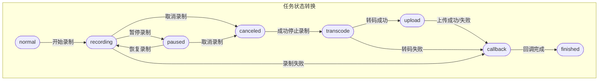
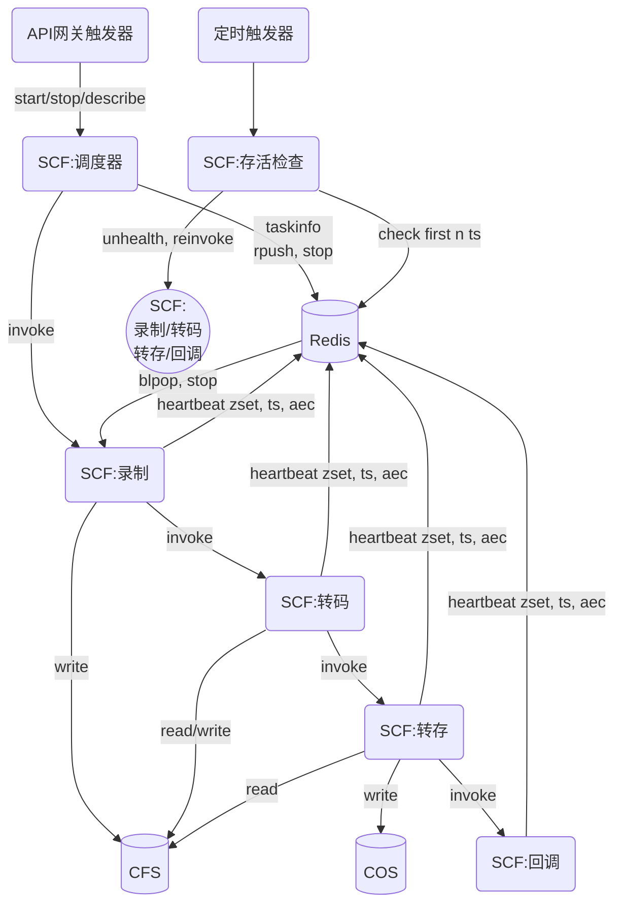

## 项目方案说明

### 方案设计





可靠性依赖于定时触发器。

#### 模块功能说明&耗时预估

模块名             | 功能描述                                                                                                                                                                                                                                                                                                                                                                                                                                                             | 耗时(d)
-----------------|------------------------------------------------------------------------------------------------------------------------------------------------------------------------------------------------------------------------------------------------------------------------------------------------------------------------------------------------------------------------------------------------------------------------------------------------------------------|------
鉴权/灰度/集群隔离 | 负责调用鉴权，灰度策略，集群隔离                                                                                                                                                                                                                                                                                                                                                                                                                                       | --
SCF:调度器         | 负责对外提供接口，并触发任务调度<br>主要功能点：<br>1. 接收发起录制请求，Invoke 录制函数，并将任务信息保存到redis，同时保存taskID与requestID的映射关系，并往zset中增加此任务的requestID,score为当前时间戳<br>2. 接收结束录制请求，往redis中与此任务相关的停止信号array中rpush一个值，以达到通知录制函数结束录制的目的<br>~~3. 接收重新录制/转码/转存/回调请求（一般是存活检查触发），kill掉原来的函数执行，并重新invoke~~<br>4. 接收查询任务信息请求，从redis/cls获取任务信息返回 | 2
SCF:存活检查       | 定时触发，通过扫描redis中的心跳时间戳zset来检查对应函数是否存活，这里的zset是一个以心跳时间戳为score的升序有序集合<br>主要功能点：<br>1. 通过zrangebyscore获取所有已超时的心跳key<br>2. 对于心跳超时的key，根据任务状态重新拉起任务（录制/转码/转存/回调）                                                                                                                                                                                                                 | 0.5
SCF:录制           | 负责WEB录制<br>主要功能点：<br>1. 定时更新redis中的心跳时间<br>2. 在异步线程中通过blpop停止信号array来等待停止录制信号<br>3. 结束录制后，更新任务状态为transcode，Invoke转码函数，并zset中增加转码函数的InvokeRequestID，将自身的requestID从zset中清除，并退出函数                                                                                                                                                                                                         | 0.5
SCF:转码           | 负责录制文件转码<br>主要功能点：<br>1. 定时更新redis中的心跳时间<br>2. 利用ffmpeg将视频文件转码成指定的格式 <br>3. 结束转码后，更新任务状态为upload，Invoke转存函数，并zset中增加转存函数的InvokeRequestID，将自身的requestID从zset中清除，并退出函数                                                                                                                                                                                                                      | 0.5
SCF:转存           | 负责录制文件转存<br>主要功能点：<br>1. 定时更新redis中的心跳时间<br>2. 将转码后的视频文件上传到指定COS桶 <br>3. 结束转码后，更新任务状态为callback，Invoke回调函数，并zset中增加转存函数的InvokeRequestID，将自身的requestID从zset中清除，并退出函数                                                                                                                                                                                                                       | 0.5
SCF:回调           | 负责结果回调通知 <br>主要功能点：<br>1. 定时更新redis中的心跳时间<br>2. 将任务信息回调到指定webhook <br>3. 结束回调后，更新任务状态为finished，将自身的requestID从zset中清除，并退出函数                                                                                                                                                                                                                                                                                 | 0.5

#### Redis数据结构说明

+ tasks:\<taskID\> => string(jsonStr(taskInfo)) 
任务信息数据结构
    ```
    taskInfo {
        TaskID string
        InvokedRequestID string
        CreateTime int // 单位s
        CancelTime int 
        StartTime int
        StopTime int
        FinishTime int
        Status string
        Param {
            RecordURL string
            Width int
            Height int
            CallbackURL string
            MaxDurationLimit int
            Output {
                Cos {
                    Domain string
                    Bucket string
                    Region string
                    TargetDir string
                    TargetName string
                }
            }
        }
        Result {
            ErrorCode string 
            ErrorMessage string
            Videos [
                {
                    Filename string
                    FileSize int
                    FileDuration int
                    FileURL string
                }
            ]

            ReplayURLs []string
        }
    }
    ```
    
+ heartbeats => zset(taskID:invokedRequestID sorted by timestamp) 
心跳有序集合，根据时间戳从小到大进行排序
+ ctrl:\<taskID\> => list(int)
录制控制信号，1 - pause, 2 - resume, 3 - stop, 4 - refresh